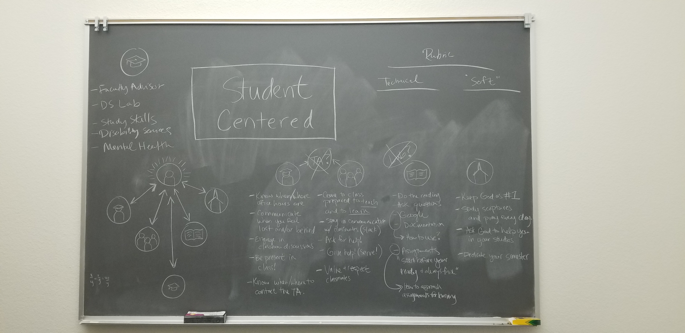

# Overview

On the first day of every semester I share the BYU - Idaho mission statement with my students.

> *Brigham Young University-Idaho was founded and is supported and guided by The Church of Jesus Christ of Latter-day Saints. Its mission is to develop disciples of Jesus Christ who are leaders in their homes, the Church, and their communities.*

We discuss how learning data science can make us better disciples of Jesus Christ and better leaders (both big "L" and small "l"). My hope is that students develop a greater appreciation for the skills they learn and understand those skills in an eternal context.

I would like to apply the same context to my favorite topics from the progressing teacher course. I believe this will provide greater clarity and motivation as I set goals for future semesters.

The topics I cover are:

1. Starting the semester with power and clarity
1. Promoting student success
1. Crafting and asking good questions

# 1. Syllabus Day

## Notes

*under development*

## Mission

*under development*

# 2. Student Success

## Notes

Some of my favorite ideas for promoting student success are developing student centered courses and establishing high love, high expectations from day one.

A diagram was showed in class one day with symbols for the teacher, the student, and the textbook. Arrows were used to illustrate the relationships between the three symbols. 

As I thought more about student centered design, I started to imagine a diagram with the student at the center and arrows pointing out to different resources. I sketched it out on my blackboard and ended up with 5 categories of resources.

1. Professor and TA (be prepared for class, communicate with professor when struggling, attend office hours, etc.)
1. Course Material (do the prep work, do the homework, know *how* to read the textbook) 
1. Classmates and student community (start a study group, be prepared to teach one another, participate in disucssions, share ideas)
1. University level resources (math tutors, disability services, counseling center, study skills, faculty mentor)
1. Spiritual resources (always put God first, study your scriptures, get enough sleep)

## Mission

If I teach students that they are in control of their learning (in the "center") and help them understand how to use the resources available to them, I believe they will be come better disciples of Jesus Christ and better leaders.

Taking responsibility for your own learning is hard. Especially if you're coming from a high school where you sat passively in your desk all day. Learning how to take responsibility in the classroom with help student take responsibility in other areas of life. They will realize the profound impact their actions have, and take more intentional actions to shape their futures.

<!--------------
"promoting student success" (1.2)
Helping Students Take Responsibility for Their Own Learning (Brian) (3.2)
---------------------->

# 3. Asking Questions

## Notes

*under development*

## Mission

*under development*

<!------------
Crafting questions and asking them well
Crafting and Asking Good Questions (Rob) (4.3)

# 4. Beginning and Ending Class

Beginning and Ending Class Well (Sid) (11.1)

# Other Resources
------------------------>